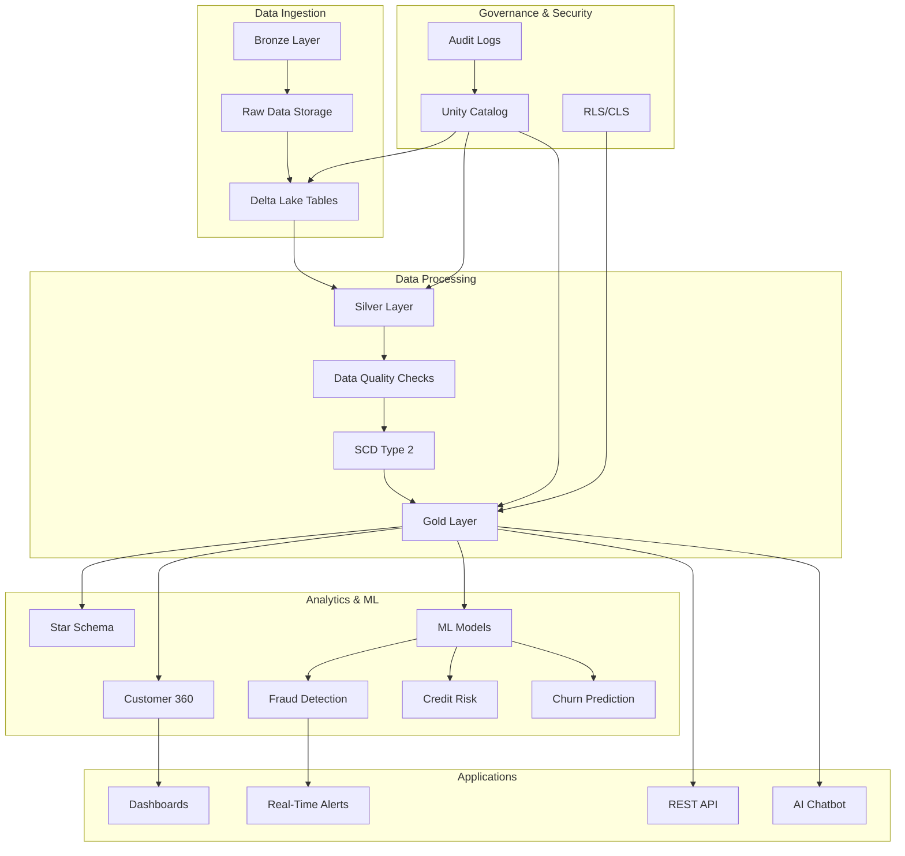
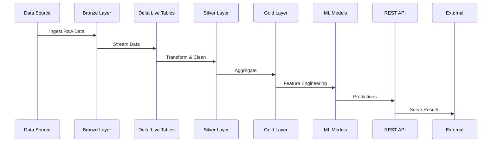
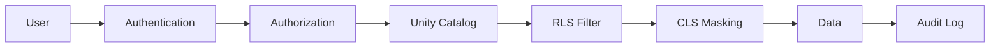
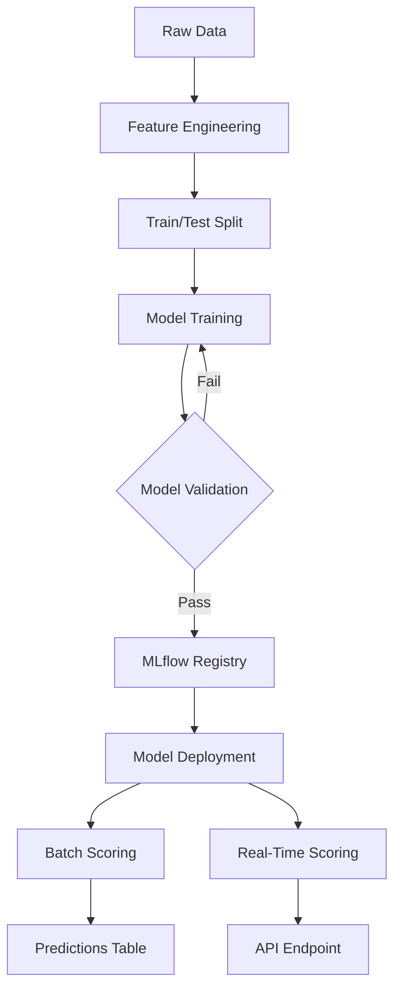
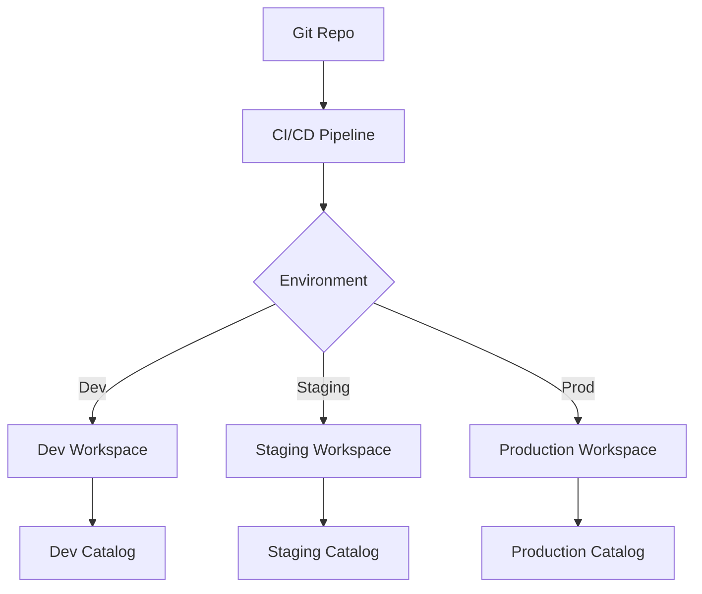
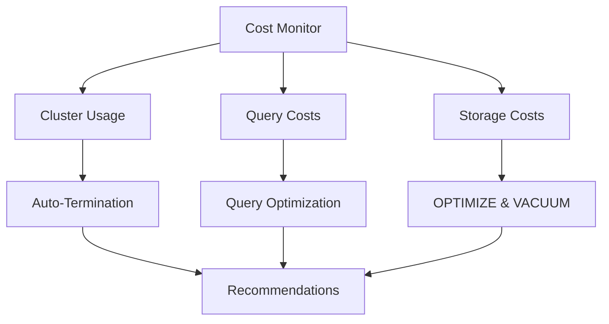
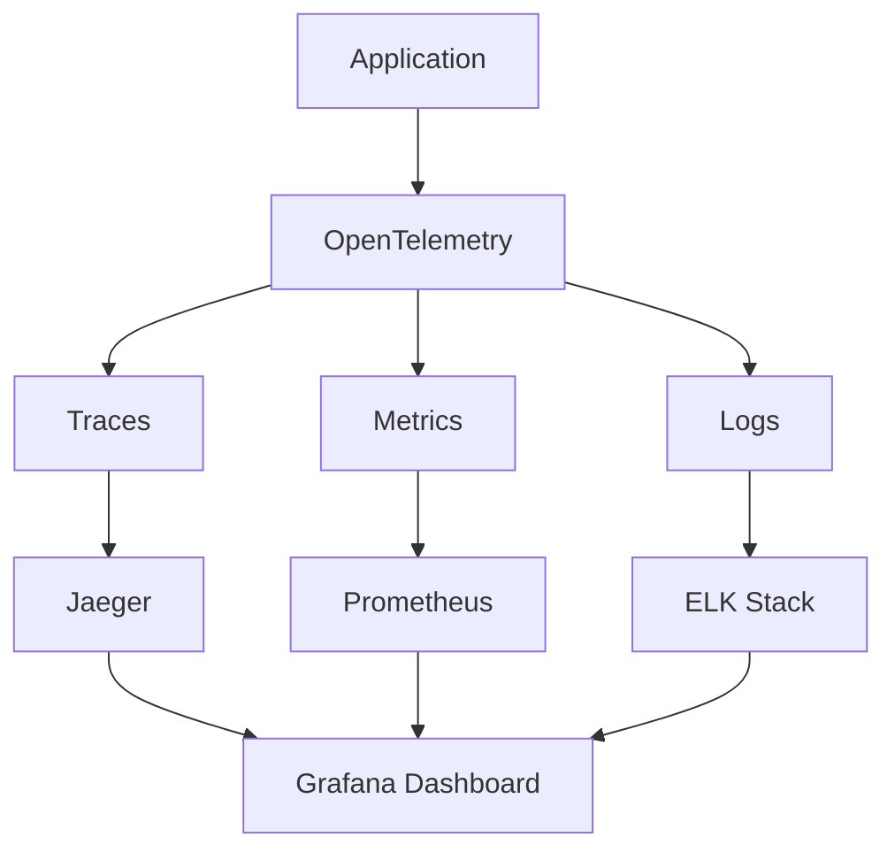

# 🏗️ Banking Data AI Platform - Architecture Documentation

## System Architecture Overview



## Medallion Architecture

### Bronze Layer (Raw Data)
- **Purpose**: Ingest raw data without transformation
- **Storage**: Delta Lake with Change Data Feed enabled
- **Tables**: customers, accounts, transactions, loans, credit_cards
- **Volume**: 1M+ customers, 5M+ transactions

### Silver Layer (Cleaned Data)
- **Purpose**: Cleaned, validated, and standardized data
- **Transformations**: 
  - Data quality checks
  - Deduplication
  - Schema enforcement
  - SCD Type 2 for historical tracking
- **Tools**: Delta Live Tables (DLT)

### Gold Layer (Business Aggregations)
- **Purpose**: Business-ready analytics tables
- **Models**:
  - Star Schema (fact & dimension tables)
  - Customer 360 view
  - Fraud analytics
  - Risk metrics

## Data Flow Architecture



## Security Architecture

### Multi-Layer Security



### Security Layers:
1. **Authentication**: OAuth 2.0, SSO
2. **Authorization**: Role-Based Access Control (RBAC)
3. **Unity Catalog**: Centralized governance
4. **Row-Level Security (RLS)**: Branch/region-based filtering
5. **Column-Level Security (CLS)**: PII masking
6. **Audit Logging**: 7-year retention

## ML Pipeline Architecture



## Deployment Architecture

### Multi-Environment Strategy



### Environment Specifications:

| Environment | Purpose | Cluster Size | Schedule | Data Volume |
|-------------|---------|--------------|----------|-------------|
| **Dev** | Development & Testing | 1-2 workers | PAUSED | Sample data |
| **Staging** | UAT & Pre-prod | 2-4 workers | Daily | Full data |
| **Production** | Live system | 4-8 workers + autoscale | Hourly | Full data |

## Cost Optimization Architecture



## Observability Architecture



## Technology Stack

### Data Platform
- **Compute**: Databricks (Apache Spark)
- **Storage**: Delta Lake
- **Catalog**: Unity Catalog
- **Orchestration**: Databricks Workflows

### Data Processing
- **ETL**: Delta Live Tables (DLT)
- **Streaming**: Structured Streaming
- **CDC**: Change Data Feed (CDF)

### Machine Learning
- **Training**: MLlib, Scikit-learn
- **Tracking**: MLflow
- **Serving**: Model Registry + REST API

### Applications
- **API**: FastAPI
- **Chatbot**: Streamlit
- **Dashboards**: Streamlit, Plotly

### DevOps
- **CI/CD**: GitHub Actions
- **IaC**: Databricks Asset Bundles
- **Testing**: pytest
- **Linting**: black, flake8, pylint

### Security
- **Governance**: Unity Catalog
- **Secrets**: Azure Key Vault / AWS Secrets Manager
- **Encryption**: Delta Lake encryption
- **Compliance**: GDPR, SOX, PCI-DSS

## Network Architecture

```
┌─────────────────────────────────────────┐
│         Internet / Users                 │
└───────────────┬─────────────────────────┘
                │
        ┌───────▼────────┐
        │   Load Balancer │
        └───────┬────────┘
                │
    ┌───────────┴───────────┐
    │                       │
┌───▼────┐          ┌──────▼─────┐
│  API   │          │  Dashboards │
│ FastAPI│          │  Streamlit  │
└───┬────┘          └──────┬──────┘
    │                      │
    └──────────┬───────────┘
               │
       ┌───────▼────────┐
       │   Databricks    │
       │   Workspace     │
       └───────┬─────────┘
               │
    ┌──────────┴──────────┐
    │                     │
┌───▼────┐        ┌──────▼─────┐
│  Delta │        │   Unity    │
│  Lake  │        │  Catalog   │
└────────┘        └────────────┘
```

## Scaling Strategy

### Horizontal Scaling
- **Auto-scaling clusters**: Based on queue size
- **Multi-cluster warehouses**: For concurrent queries
- **Partition strategy**: Date-based for large tables

### Vertical Scaling
- **Larger node types**: For memory-intensive workloads
- **SSD-backed instances**: For I/O-intensive operations

## Disaster Recovery

### Backup Strategy
- **Delta Lake Time Travel**: 30-day history
- **Cross-region replication**: For critical data
- **Incremental backups**: Daily
- **Full backups**: Weekly

### Recovery Objectives
- **RTO (Recovery Time Objective)**: < 4 hours
- **RPO (Recovery Point Objective)**: < 15 minutes
- **Data Retention**: 7 years (banking compliance)

## Performance Optimization

### Query Optimization
- Z-ordering on high-cardinality columns
- Liquid clustering for evolving queries
- Caching for frequently accessed data

### Storage Optimization
- OPTIMIZE: Regular compaction
- VACUUM: Clean up old files
- Partition pruning: Date-based partitioning

### Compute Optimization
- Photon acceleration
- Adaptive Query Execution (AQE)
- Dynamic partition pruning

---

**Last Updated**: October 19, 2025  
**Version**: 1.0.0  
**Status**: Production Ready ✅

